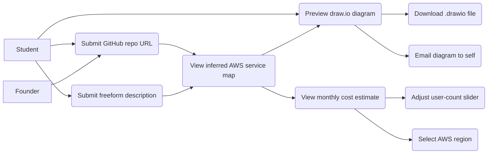
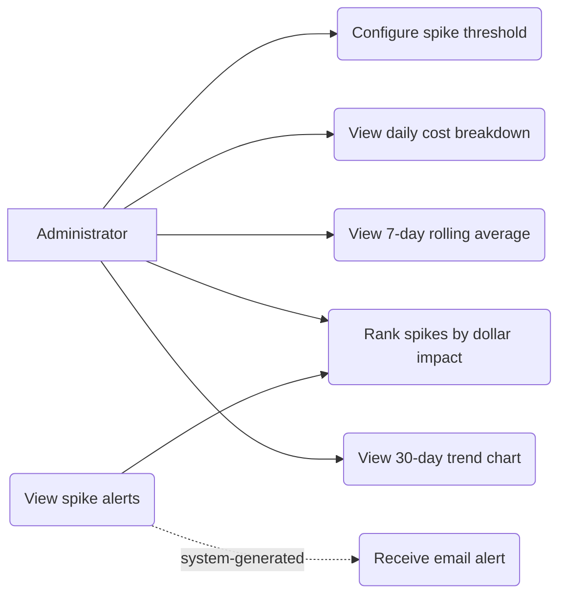
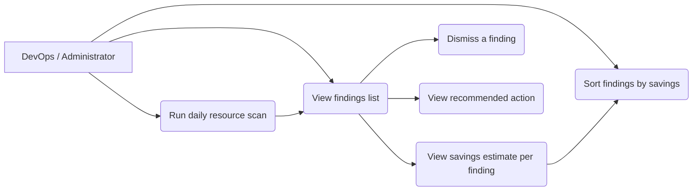
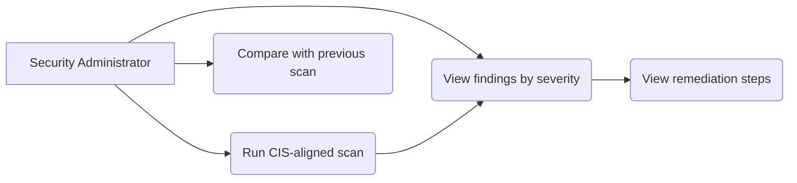
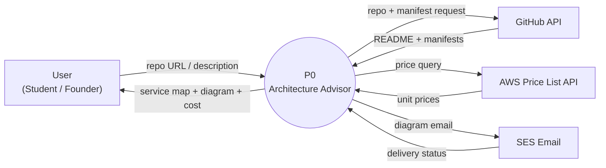
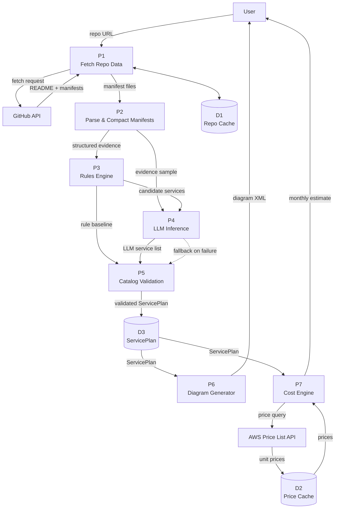
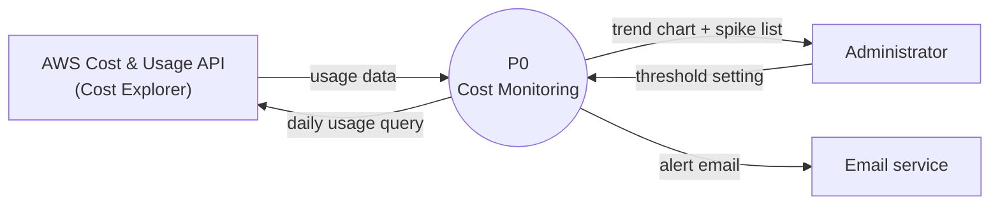

# DFD & Use Case Diagrams

Project: AWS Cloud Governance Platform (Modules A–D).
Mermaid diagrams — render on GitHub / VS Code / any mermaid-enabled markdown viewer.

## Use Case Diagrams

### Module A — AI Architecture Advisor


### Module B — Cost Monitoring & Anomaly Detection


### Module C — Resource Optimization Engine


### Module D — Security Posture Scanner


## DFD — Module A: AI Architecture Advisor

### Level 0 (Context Diagram)


### Level 1 (Decomposed)


## DFD — Module B: Cost Monitoring & Anomaly Detection

### Level 0 (Context Diagram)


### Level 1 (Decomposed)
```mermaid
flowchart TD
    CE["AWS Cost & Usage API"]
    Admin["Administrator"]
    Mail["Email service"]
    P1["P1<br/>Daily Ingestion"]
    P2["P2<br/>Rolling Average"]
    P3["P3<br/>Spike Detection"]
    P4["P4<br/>Spike Ranking"]
    P5["P5<br/>Trend Reporting"]
    P6["P6<br/>Alert Dispatch"]
    D1[("D1<br/>Cost Data Store<br/>(TimescaleDB)")]
    D2[("D2<br/>Threshold Config")]
    D3[("D3<br/>Spike Log")]

    P1 -->|daily usage query| CE
    CE -->|usage data| P1
    P1 -->|store raw costs| D1
    Admin -->|threshold| D2
    D1 -->|daily costs| P2
    P2 -->|7-day avg| P3
    D2 -->|threshold| P3
    D1 -->|usage history| P5
    P3 -->|spike flags| P4
    P4 -->|ranked spikes| D3
    P4 -->|ranked alerts| P6
    P6 -->|alert email| Mail
    P5 -->|30-day trend chart| Admin