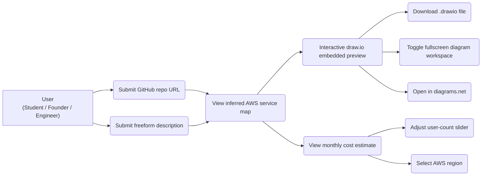
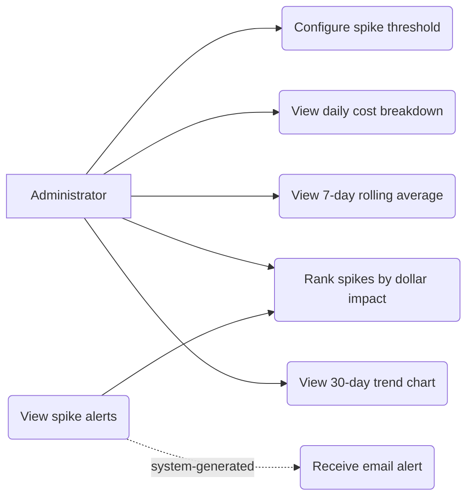
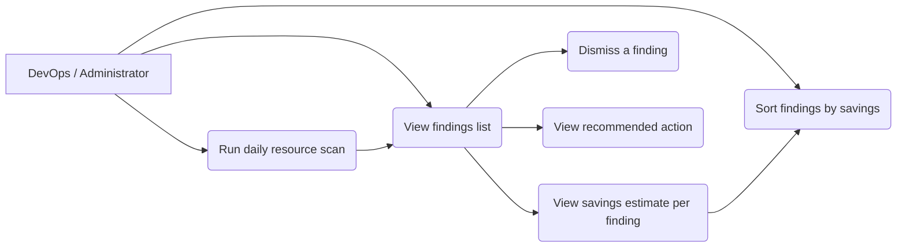
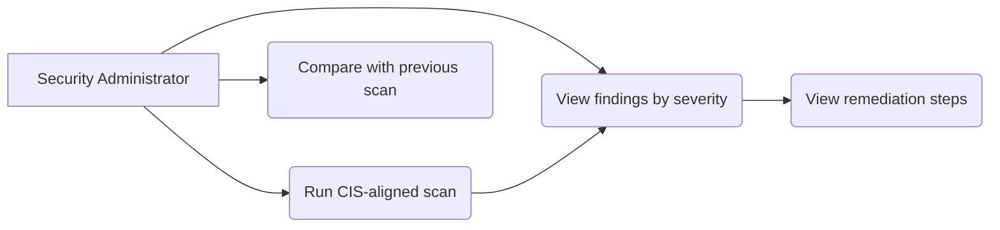
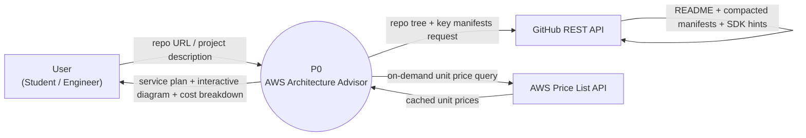
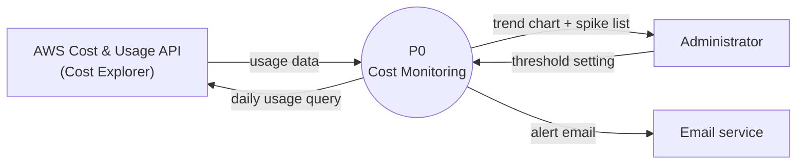

# DFD & Use Case Diagrams

Project: **AWS Architect — Module A (AI Architecture Advisor)**.
Mermaid diagrams — render on GitHub / VS Code / any mermaid-enabled markdown viewer.

> **Scope note (2026-09-05):** project scope is **Module A only**. The Module B / C / D use-case and DFD sections below are retained as the **original design record from the four-module SRS phase** — they are **descoped and not implemented**, and are not upcoming work. Only the Module A sections and the mxGraph engine section describe the built system. See `DECISIONS.md` Decision 46.

## Use Case Diagrams

### Module A — AI Architecture Advisor


### Module B — Cost Monitoring & Anomaly Detection — DESCOPED (2026-09-05)

*Not implemented, not planned. Original four-module design record only.*


### Module C — Resource Optimization Engine — DESCOPED (2026-09-05)

*Not implemented, not planned. Original four-module design record only.*


### Module D — Security Posture Scanner — DESCOPED (2026-09-05)

*Not implemented, not planned. Original four-module design record only.*


## DFD — Module A: AI Architecture Advisor

### Level 0 (Context Diagram)


### Level 1 (Decomposed)
```mermaid
flowchart TD
    User["User"]
    GH["GitHub REST API"]
    PRICE["AWS Price List API"]
    P1["P1<br/>Fetch Repo Signals"]
    P2["P2<br/>Parse Manifests & SDK Signals"]
    P3["P3<br/>Rule Engine Baseline"]
    P4["P4<br/>LLM Structured Inference"]
    P5["P5<br/>Catalog & Schema Validation"]
    P6["P6<br/>Diagram Engine (Layout & Routing)"]
    P7["P7<br/>Cost Calculation Engine"]
    D1[("D1<br/>Repo Evidence Cache")]
    D2[("D2<br/>Price Catalog Cache")]
    D3[("D3<br/>Validated ServicePlan")]

    User -->|repo URL / description| P1
    P1 <--> D1
    P1 -->|tree & file queries| GH
    GH -->|key files (.raw / contents)| P1
    P1 -->|manifests & source files| P2
    P2 -->|parsed dependencies & SDK calls| P3
    P2 -->|structured profile & evidence| P4
    P3 -->|deterministic baseline plan| P5
    P4 -->|candidate services & relationships| P5
    P4 -. fallback on failure .-> P5
    P5 -->|validated ServicePlan| D3
    D3 -->|ServicePlan| P6
    P6 -->|centered, collision-free mxGraph XML| User
    D3 -->|ServicePlan| P7
    P7 -->|on-demand pricing request| PRICE
    PRICE -->|unit prices| D2
    D2 -->|cached prices| P7
    P7 -->|monthly cost rows & slider formulas| User
```

## DFD — Module B: Cost Monitoring & Anomaly Detection — DESCOPED (2026-09-05)

*Not implemented, not planned. Retained as the original four-module SRS design record. The Cost Explorer ingestion and TimescaleDB store shown below are not part of this project — see `DECISIONS.md` Decision 46.*

### Level 0 (Context Diagram)


### Level 1 (Decomposed)
```mermaid
flowchart TD
    CE["AWS Cost & Usage API"]
    Admin["Administrator"]
    Mail["Email service"]
    P1["P1<br/>Daily Ingestion"]
    P2["P2<br/>Rolling Average"]
    P3["P3<br/>Spike Detection"]
    P4["P4<br/>Spike Ranking"]
    P5["P5<br/>Trend Reporting"]
    P6["P6<br/>Alert Dispatch"]
    D1[("D1<br/>Cost Data Store<br/>(TimescaleDB)")]
    D2[("D2<br/>Threshold Config")]
    D3[("D3<br/>Spike Log")]

    P1 -->|daily usage query| CE
    CE -->|usage data| P1
    P1 -->|store raw costs| D1
    Admin -->|threshold| D2
    D1 -->|daily costs| P2
    P2 -->|7-day avg| P3
    D2 -->|threshold| P3
    D1 -->|usage history| P5
    P3 -->|spike flags| P4
    P4 -->|ranked spikes| D3
    P4 -->|ranked alerts| P6
    P6 -->|alert email| Mail
    P5 -->|30-day trend chart| Admin

---

## AWS Architecture Diagram Generation (Draw.io / mxGraph Engine)

The system transforms an inferred `ServicePlan` into standard `.drawio` XML (mxGraph model format), rendered interactively in an embedded iframe and downloadable as a `.drawio` file.

### 1. Visual Hierarchy & Well-Architected Containers
AWS resources are partitioned deterministically into logical tiers matching AWS Well-Architected security zones:

| Container | Visual Role | Color Theme & Border | Dimensions & Placement |
|-----------|-------------|----------------------|------------------------|
| **Edge & Public Ingress** | Top entry banner (DNS, CDN, WAF, API Gateway, ALB) | `#F8FAFC` fill, `#CBD5E1` border (1.5px) | Spans the full width across VPC and external services |
| **Virtual Private Cloud (VPC)** | Outer security perimeter | `#FFFFFF` fill, `#1E293B` border (2px solid) | Wraps Public, Compute, and Data subnets with padding |
| **Public Subnet (DMZ)** | Public-facing network resources (NAT, Bastion) | `#F0FDF4` fill, `#22C55E` border (dashed 6 4) | Left-aligned inside VPC |
| **Compute Subnet (Private)** | Application compute instances (ECS, Lambda, EKS) | `#EFF6FF` fill, `#3B82F6` border (dashed 6 4) | Positioned beside Public Subnet inside VPC |
| **Data & Storage Subnet (Isolated)** | Persistence, caching, queues (RDS, Aurora, S3, ElastiCache, SQS) | `#FAF5FF` fill, `#A855F7` border (dashed 6 4) | Positioned below Compute Subnet inside VPC with gutter channel |
| **External Cloud Services** | Third-party or standalone AWS services (SES, Amplify) | `#F8FAFC` fill, `#94A3B8` border (1.5px) | Anchored to the right edge of the VPC box |

*Container titles are pinned to the top-left (`align=left;spacingLeft=16;spacingTop=6;`) so vertical edges traversing into subnets never cross title text.*

### 2. Node Geometry & Collision-Free Label Allocation
* **Official AWS Icons:** Official AWS 2026 shape library (`shape=mxgraph.aws4.*`), rendered at $56 \times 56\text{ px}$.
* **Full-Label Bounding Boxes:** Node slots are allocated with `CELL_W = 116px`, `CELL_H = 80px`, and `GAP = 32px`.
* **Intelligent Multi-Line Word Wrapping (`wrapServiceName`):**
  * Display names longer than 16 characters are wrapped into balanced multi-line strings (e.g., `Application Load\nBalancer (ALB)`, `AWS Secrets\nManager`, `Amazon\nDocumentDB`).
  * Text width stays within $\sim 100\text{px}$, leaving $\ge 40\text{px}$ of horizontal whitespace between adjacent nodes in the same row and $\ge 28\text{px}$ vertically between rows.
* **Service Deduplication:** Generic duplicate service mappings in the same tier are unified into a single master node with re-routed connections, while distinct roles are preserved via role subtitles (e.g., `Amazon S3\n(Static Assets)` vs `Amazon S3\n(User Uploads)`).

### 3. Collision-Free Orthogonal Edge Routing (`routeEdges`)
* **Stepped Gutter Channels:** Edge waypoints are routed through the empty channels between container tiers (`midY = (srcBot + dstTop) / 2`), preventing lines from cutting through intermediate service nodes.
* **Horizontal Branching Bus:** Compute-to-data connections (e.g., `ECS` $\rightarrow$ `RDS`, `ElastiCache`, `S3`) branch cleanly across tier gutters.
* **Arrowhead Visibility:** Every connection features prominent classic arrowheads terminating at the destination node.
* **Shielded Label Badges:** Edge labels (`reads`, `writes`, `route`, `invoke`) are rendered with opaque white pill badges (`labelBackgroundColor=#FFFFFF;` with border and padding), preventing lines from striking through words.
* **Solid vs Dashed Distinction:**
  * **Solid Edges (`#232F3E`, 1.5px):** Explicitly confirmed relationships backed by codebase manifests, Docker Compose links, or SDK calls.
  * **Dashed Edges (`#6B7280`, dash pattern `8 8`, 1px):** Pattern-inferred topology hints with tooltips.

### 4. Mathematical Viewport Centering
To prevent architectures from being rendered with unbalanced whitespace:
1. Calculates the tight bounding box $(minX, minY, maxX, maxY)$ of all active containers and nodes.
2. Computes the target canvas size with uniform padding (`CANVAS_PAD_X = 64px`, `CANVAS_PAD_Y = 56px`).
3. Derives the exact translation offset:
   $$\text{shiftX} = \frac{\text{canvasW} - \text{contentW}}{2} - \text{minX}, \quad \text{shiftY} = \frac{\text{canvasH} - \text{contentH}}{2} - \text{minY}$$
4. Translates all active containers and node coordinates by $(\text{shiftX}, \text{shiftY})$. Margins on left/right and top/bottom are equal with $0\text{px}$ differential.

### 5. Interactive Workspace & Draw.io Embed Protocol
* **Embed Protocol:** Hosted via diagrams.net embed mode (`https://embed.diagrams.net/?embed=1&ui=atlas&spin=1&modified=unsavedChanges&proto=json&fit=1`).
* **PostMessage Handshake:** On the `init` event, the client transmits `{ action: "load", xml: diagramXml, autosize: 1 }` and `{ action: "center" }`.
* **Dynamic Resize Centering:** Listening to window `resize` events dispatches `{ action: "center" }` to ensure the diagram remains centered.
* **Responsive Layout:** Embedded inside a balanced workspace container (`max-w-7xl` with `mx-auto` and `h-[74vh]` vertical viewport), with a toolbar supporting **Fullscreen Workbench Mode** (`100vw \times 100vh`), client-side `.drawio` file download, and direct link to app.diagrams.net.